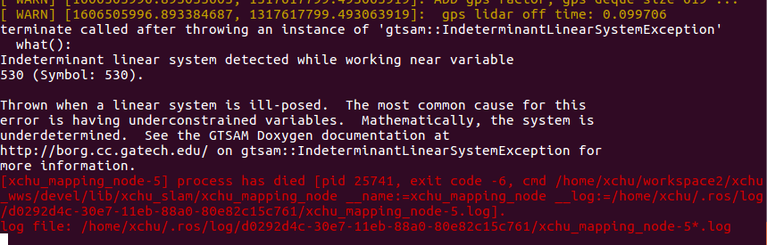

# XCHU_SLAM

### 更新说明

**11.28**：引入GNSS初始化，并大幅改进里程计精度，但出现两个bug

- 回环优化第二次会挂掉，原因不明

- 因子图加入gps factor时，gtsam会报错，原因不明，可以设置use_gps = false：



## Introduction

GPS_ODOM：简单的全局odom，采用gnss作为位置，姿态为距离GNSS帧最近的imu帧的姿态。

- 里程计：基于NDT的里程计，利用imu、编码器来优化初始位姿估计，基于匀速运动模型，当同时使用编码器和imu时，选取imu的姿态和编码器的速度信息。初始化采用GNSS，不再是单位矩阵。

- 局部地图：按距离选取，累计到局部地图距离阈值刷新，而不是滑窗逐帧更新

- 后端优化：取协方差较小的GPS位置加入因子图中（目前还有点bug）。

- 回环检测：邻域距离搜索+ICP匹配。


下图是优化后的kitti轨迹（version 1.0）


高度上偏移纠正回来了。


## Dependency

- [GTSAM](https://github.com/borglab/gtsam/releases)(最好采用4.0.0-alpha2版本)

## Usage

### Run the package

1. Run the launch file:

```shell
roslaunch xchu_slam  mapping.launch 
```

2. Play existing bag files kitti, bag包播放时请0.1倍速，因为目前性能上还未优化，在bag包播放完成后，建图也将结束。

```shell
rosbag play kitti_2011_10_03_drive_0027_synced.bag --clock -r 0.1
```

   3.ctrl+c关闭终端则自动保存地图到xchu_slam/pcd中

### 重要参数

- keyframe_dist：关键帧的选取距离，太近容易重影，太远丢失细节
- surround_search_num：locamap的点云帧数量，太大导致拼localmap时效率变慢，精度却不一定变好
- use_odom: 是否使用编码器，在launch文件中可修改
- use_imu：是否使用imu，在launch中修改，可同时支持imu和编码器
- history_search_num_： 回环检测时选取的邻域内的点云帧数量

其余参数应该默认就可以了，不需要自行修改。


## Issues

- 线程安全
- pitch 的累计误差导致高度漂移问题
- 位姿有抖动情况

## TODOs

- 雷达惯导紧耦合
