# XCHU_SLAM

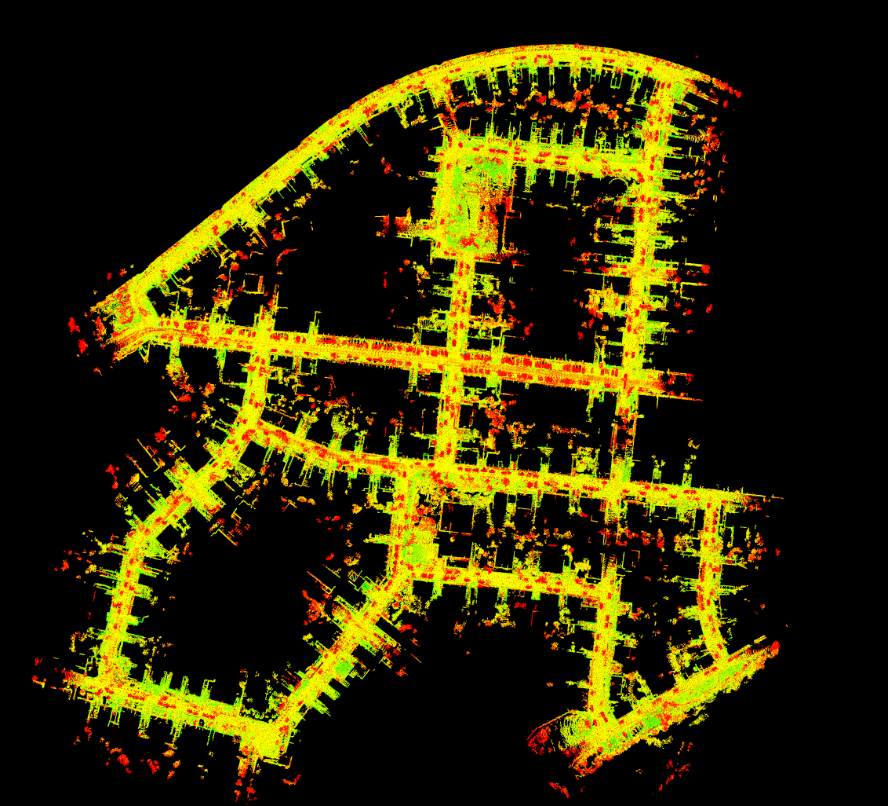

## Introduction

- 里程计：基于NDT的里程计，利用imu、编码器来优化初始位姿估计，基于匀速运动模型，当同时使用编码器和imu时，选取imu的姿态和编码器的速度信息。

- 局部地图：采用两种策略的localmap, 实测方法2效果更好
  1.基于关键帧数量选取, 关键帧数量够则滑窗更新, 去除旧的加入新的
  2.基于距离选取关键帧, 基于localmap距离阈值刷新, 每个周期内localmap关键帧数量从1开始增加

- 后端优化：取协方差较小的GPS位置加入因子图中（暂不可用）。

- 回环检测：三种方法，

  1.传统的邻域距离搜索+ICP匹配。

  2.基于scan context的回环检测。
  
  3.基于Intensity scan context的回环检测。
  
  下图中，蓝色表示因子图中的位姿节点，红色线段表示回环约束边，绿色线段表示里程计相对位姿约束。
  
  
  
  

## Dependency

- [GTSAM](https://github.com/borglab/gtsam/releases)(最好采用4.0.0-alpha2版本)

## Usage

### Run the package

1. Run the launch file:

```shell
roslaunch xchu_mapping  xchu_mapping.launch 
```

2. Play   kitti 00 bag, bag包播放时请1倍速，因为是SLAM系统，在bag包播放完成后，节点将暂停，可能出现bag包播完了，但里程计还未跑完的情况。

```shell
rosbag play kitti_2011_10_03_drive_0027_synced.bag --clock
```

   3.ctrl+c关闭终端则自动保存地图到xchu_mapping/pcd中。关闭终端会在pcd文件夹中生成tum格式的pose数据odom_tum.txt，可以利用evo工具计算其RPE和APE误差。

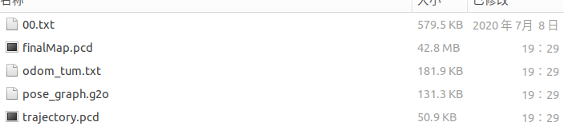

### 性能及实验

在KITTI 01上序列上进行测试，需要将ground truth拷贝到文件夹下，安装evo工具，并将KITTI gt转换为TUM格式。

- APE评估，RMSE=1.61m

```sh
evo_ape tum  00.txt odom_tum.txt -p --plot_mode=xz -a 
```

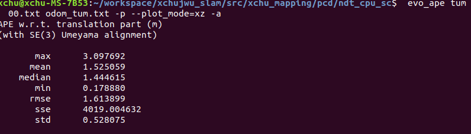

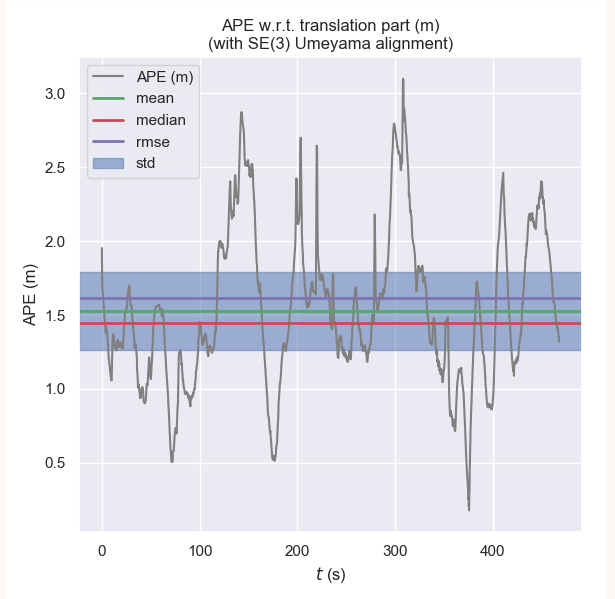

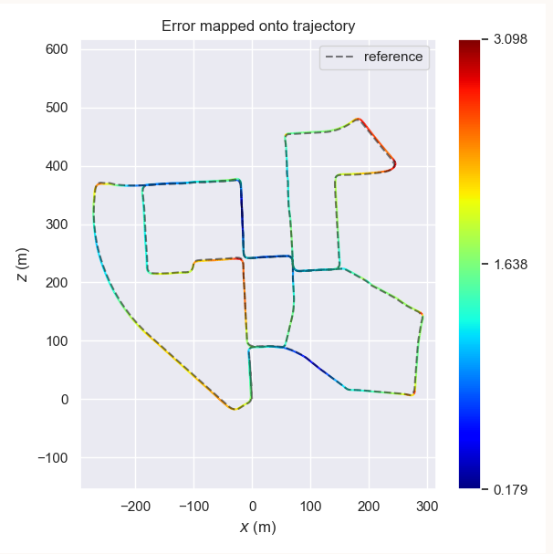

- RPE评估，RMSE = 3.405m
```sh
evo_rpe tum  00.txt odom_tum.txt -p --plot_mode=xz -a 
```


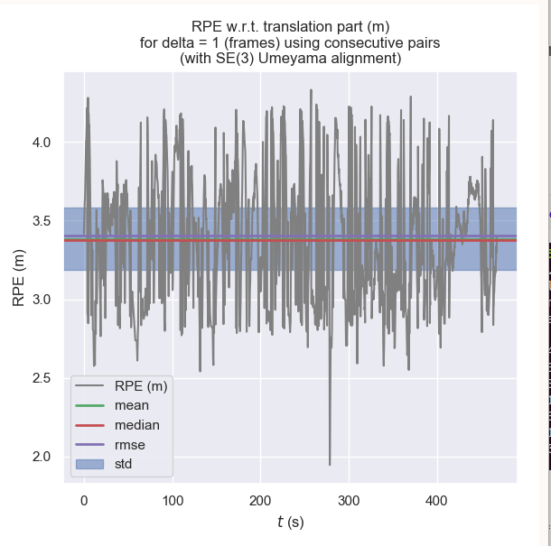

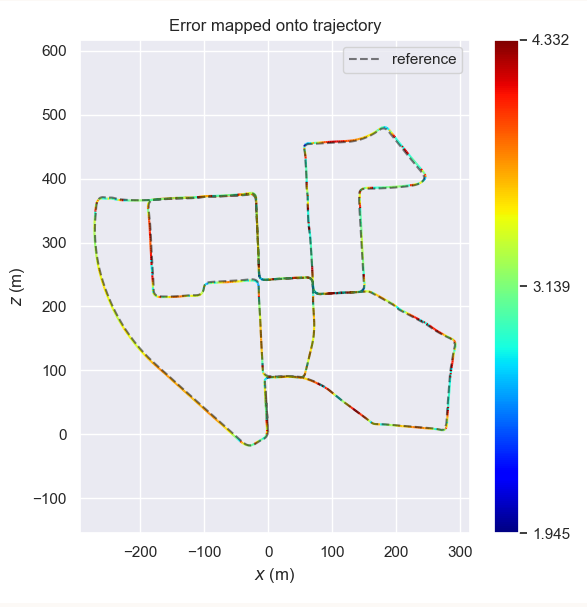

- 轨迹误差，漂移约16.569m/3724.187m=0.44%

```sh
evo_traj tum  00.txt odom_tum.txt --ref=00.txt -p -a --plot_mode=xyz
```

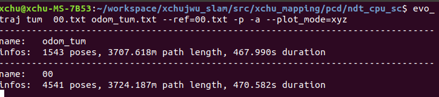

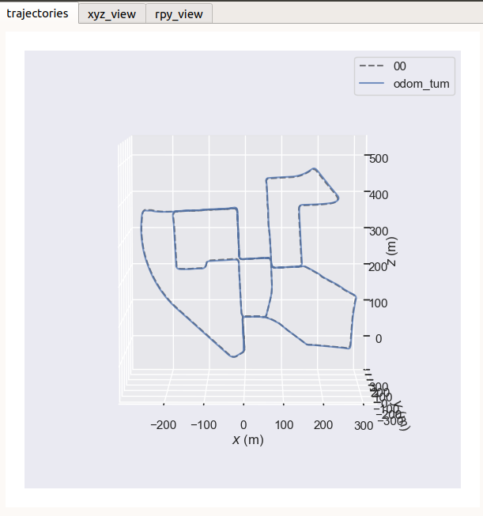

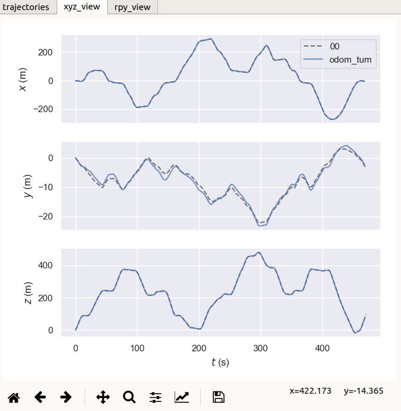


## TODOs

- 雷达惯导紧耦合
- 更多高效的回环检测方法
- 离线版本

### 效果图

下图是优化后的kitti轨迹（version 1.0）

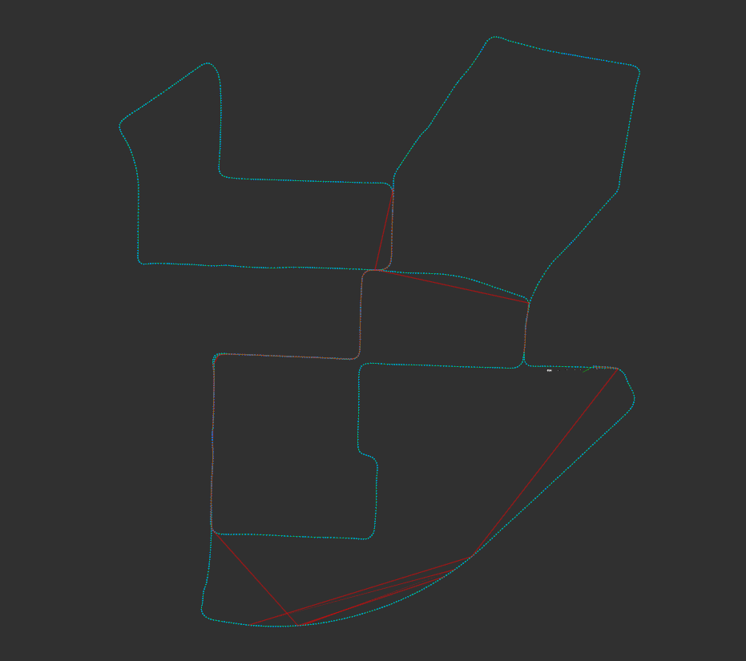

高度上偏移纠正回来了。

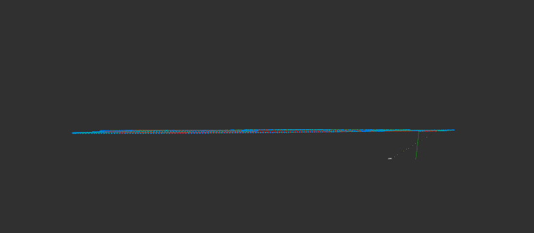

### Reference

- **LEGO-LOAM/SC-LEGO LOAM**
- **SCAN CONTEXT**
- **LIO SAM**
- **AUTOWARE**
- **NDT_OMP**