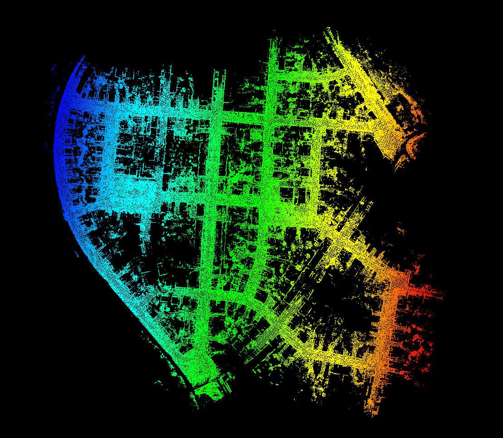

# XCHU_SLAM

## Introduction

基于NDT的里程计，利用imu、编码器来优化初始位姿估计。

回环，参考LEGO-LOAM。





高度上偏移纠正回来了。


## Dependency

- [GTSAM](https://github.com/borglab/gtsam/releases)(最好采用4.0.0-alpha2版本)

## Usage

### Run the package

1. Run the launch file:

```shell
roslaunch xchu_slam  mapping.launch 
```

2. Play existing bag files kitti, bag包播放时请0.1倍速，因为目前性能上还未优化，在bag包播放完成后，建图也将结束。

```shell
rosbag play kitti_2011_10_03_drive_0027_synced.bag --clock -r 0.1
```

  3.ctrl+c关闭终端则自动保存地图

## Issues

- 线程安全
- pitch 的累计误差导致高度漂移问题
- 位姿有抖动情况

## TODOs

- 雷达惯导紧耦合
- 基于GPS的回环检测和后端优化
